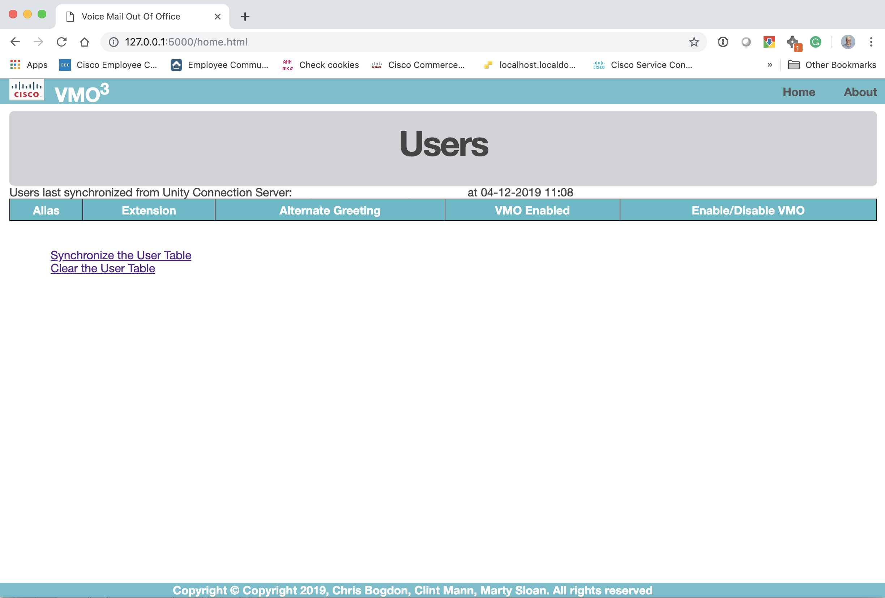
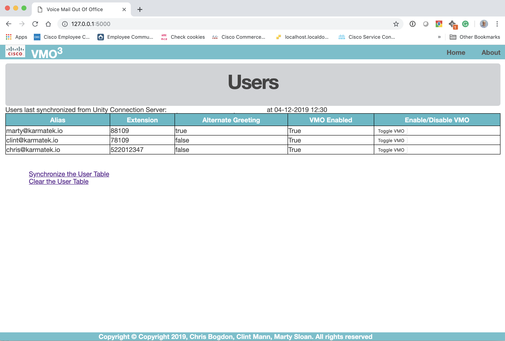
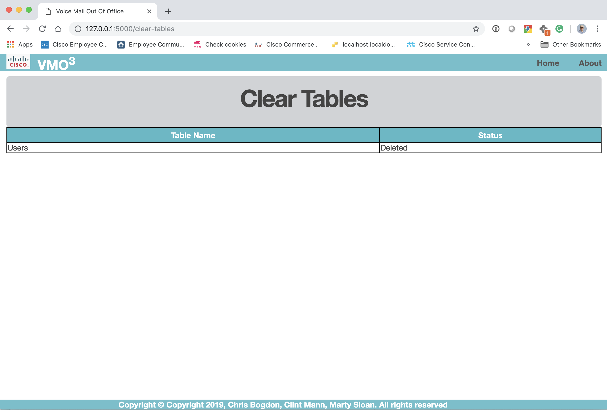

# VMO<sup>3</sup> - vmo-mediator

## Description
The vmo-mediator is the microservice that is responsible for bridging together the functionality of the Outlook Monitor and the TODO.  It allows the user to select what users will be monitored for Out of Office functionality.   In addition, it will forward the appropriate requests between the Outlook Monitor and the TODO.

## Functional Details
When the vmo-mediator first starts it will be looking for either API requests or process functionality from the GUI.  

### Database Synchronization
On the main GUI, there is an option for database synchronization.   When you start this function, the vmo-mediator will go out to the Unity Connection server and download all the users that are in the database.   From here we can activate the VMO functionality for individual users and monitor their functionality.

### Outlook Monitor
The application will also receive request calls from the Outlook Monitor piece.   There is an exposed REST API that will be used to communicate status to and from the Outlook Monitor and vmo-mediator.   Anytime, the Outlook Monitor detects a change in the OOO status, it will alert the vmo-mediator via a REST API and then the appropriate status will be communicated to the Unity Connection

## Requirements

The vmo-mediator.py was writting using Python 3.6.   It also seems to work with Python 3.7 as well.   The ```requirements.txt``` file describes the requirements of modules when using the vmo-mediator application.   You can install these requirements by doing the following:

```bash
pip install -r requirements.txt 
```


## Configuration
The vmo-mediator.py uses a configuration file to handle all the options that need to be set.   This file will be located into the directory where the vmo-mediator.py is run.    The file is called ```package-config.ini```   The following is an example:

```bash
[vmo-mediator]
listen-ip: {Insert IP to Listen on}
listen-port: {Insert Port to Listen on}
vm-interface: {Insert Voicemail Interface IP:Port Module}
mail-interface: {Insert Mail Interface IP:Port Module}
webdebug: False
```
#### listen-ip
This ip address represents the ip address where the vmo-mediator runs on.    Normally, you can set it to ```0.0.0.0``` which would represent all ip addresses.

#### listen-port
This port is the TCP port that the local application is bound to.   You can use any port that is unused currently.

#### vm-interface
This is the full URL to the voice mail interface application

#### mail-interface
This is the full URL to the outlook interface module

#### wedbdebug
This parameter is either ```True``` or ```False```.   It represents if we turn on enhanced debugging.

## Executing the Application
To start the application, once the requirents are installed (see above), you can do the following:

```python vmo-mediator.py```

You will then see the following output:

```bash
VMO3 Mediator Starting...

Configuration Options:
listenip: 0.0.0.0
listenport: 5000
VM-interface: http://ucxn.test.com
Mail-interface: https://mail-interface.test.com
Initializing the database: vmo3.sqlite
2.6.0

```

Then to start the GUI just bring up a Web Browser to the IP Address specified in the configuration.    For example:

```http://127.0.0.0:5000```

You should then see the main screen:



## GUI

#### Main Menu
Te main screen is showed when you bring up a web browser to the IP address of the vmo-mediator.   The sample is shown below:


### Synchronize the User Table
There is a link on the main menu to Syncrhonize the User table.   This function will reach out to the UCXN system and pull in the data tables.    The following is the example of the table:



In this example, we pulled in the users, their extension, status of their alternate greeting and then if the VMO function is enabled or not.   In addition, each row has a button that allows you to either activate or deactivate the VMO functionality for that user.

### Clear the User Table
If you need to clear the user table (and clear the database), you can select the "Clear the User Table" from the main menu.    Once the database is cleared, you will see the followinfg:



## API Description

#### /api/setup
**Request Type:** GET or POST

**Parameter**: NONE

**Description:** The setup API call will be called from the mail application to initially get the state of the database.    This call is normally used when the mail application first starts.   Once the API is triggered, the vmo-mediator application send the user database table to the configured outloook interface.   

**Returns:** A JSON that represents either ```True``` or ```False```   For example:
```json
{
    "result": "True"
}
```


#### /api/toggle_status/<emailid>
**Request Type:** GET or POST

**Parameter**:  <emailid> of user

**Description:** This API Function will toggle the VMO Status for the user specified by the <emailid> of the user.

**Returns:** None

#### /api/setstatus
**Request Type:** GET or POST

**Parameter**:  JSON that represents the status of an individual user:
```json
{
	"email":{email address},
	"status":{out of office status},
	"message":{out of office message}
}
```
**Description:** When this API call is triggered, the mail application will set the current status.   For example, if a user triggers the Out of Office for the email, then they will send this JSON with the ```status``` equals to ```True```.   The ```message``` parameter can then be set to the Out of Office message.   If the ```status``` is set to ```False``` which means the Out of Office is turned off, the ```message``` parameter is ignored.

This function will then trigger the vmo-mediator to send the new out of office status to the UCXN server.

**Returns:** JSON representing the success of the function call.   If the result, then the result was successful and the json will represent that.

```json
{
    "result": "True"
}
```
If the data passed to the function has invalid JSON, then the function will return a status of 400 with the following result

```json
{
    "result": "Invalid JSON"
}
```

If there was an internal error, then a different HTTP Status Code will be returned wiht the following:
```json
{
    "result": "Internal Error"
}
```

If there was a unknown error, the function call will return a 403 and the following:
```json
{
    "result": {generic error message}
}
```

If the email address was not found, the function call will return a 404 and the following:
```json
{
    "result": "Not Found"
}
```


